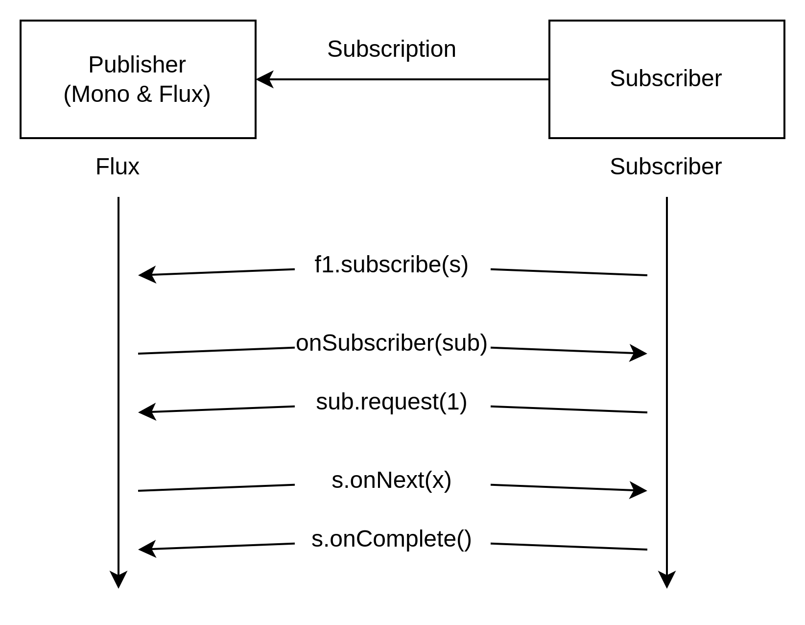

## Spring Reactive

---

https://www.reactivemanifesto.org

---

Reactive systems have certain characteristics that make them ideal for low-latency, high-throughput workloads.

`Reactive programming is a programming paradigm where the focus is on developing asynchronous and non-blocking components`. The core of reactive programming is a data stream that we can observe and react to, even apply back pressure as well. This leads to non-blocking execution and hence to better scalability with fewer threads of execution.

---

 - `Responsive`: A reactive system should provide a rapid and consistent response time and hence a consistent quality of service
 - `Resilient`: A reactive system should remain responsive in case of random failures through replication and isolation
 - `Elastic`: Such a system should remain responsive under unpredictable workloads through cost-effective scalability
 - `Message-Driven`: It should rely on asynchronous message passing between system components

---

Problems:
 - Failure in either inventory service or shipping service can have a cascading effect
 - The calls to external systems and database are all blocking in nature
 - The deployment cannot handle failures and fluctuating loads automatically

---




* Difference between mono and flux it's the same as one-many relation. Mono can have only 1 item, where flux can have arrays.

```kotlin
val f1 = Flux.just(1, 2, 3, 4, 5) // the values need to be consumed

f1.subscribe { println(it) } // here we add a subscriber to consume the Flux
```